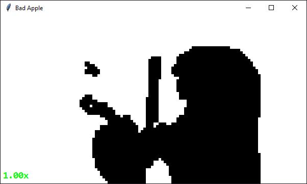

<a href="https://">
  
</a>

# Bad Apple!! Tkinter in real time and with Audio support
This is a stupid little program that I made because I was bored

## How can I run this program?
### Note: MAKE SURE TO INSTALL PYTHON TO PATH, OTHERWISE IT WILL NOT WORK!!


Download the files [here](https://github.com/malworcze/tkinter-bad-apple/archive/refs/heads/main.zip)

This program was coded in Python 3.11.x because I used PyGame for the real-time audio support but If you want to use the newest python you can use it too, There is some modules that I use to make this possible, you may install it with the command below using pip
```
pip install opencv-python pygame-ce pillow numpy
```

or
```
pip install -r requirements.txt
```

and then run the ``script.py`` file


## Showcase

I showcased it here
[](https://www.youtube.com/watch?v=D4BxdDolzf0)

## Why I did this project?
I did this because It's cool and I want to see how far Tkinter can go so I made this, I optimized it with RAM Caching which means Frames can load faster because It don't go into the I/O which is slow especially for mechnanical hard-drive systems, so I made the frames go to RAM instead because RAM is very fast *(dw it's only using less than 100mb)* and I add frame skipping so whenever the computer struggle it skips the frame instead (I did this by just putting the last frame as placeholder for the skipped frames, making the audio synced)
