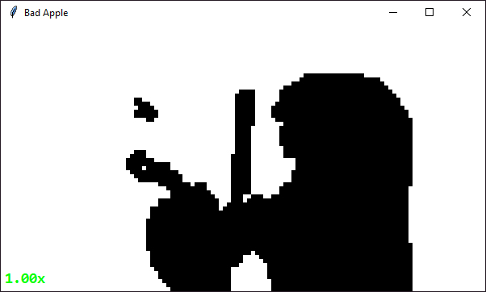

<a href="https://">
  
</a>

# Bad Apple Tkinter
im bored

## How can I run this program?
### Note: MAKE SURE TO INSTALL PYTHON TO PATH, OTHERWISE IT WILL NOT WORK!!

Download the code [here](https://github.com/malworcze/tkinter-bad-apple/archive/refs/heads/main.zip)
install the dependencies first
```
pip install opencv-python pygame-ce pillow numpy
```

and then run the ``script.py`` file

## Why I did this project?
im bored as hell
